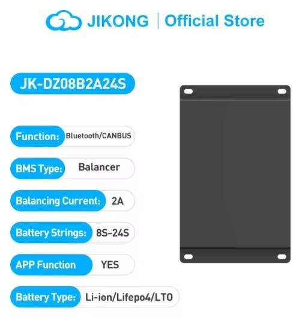
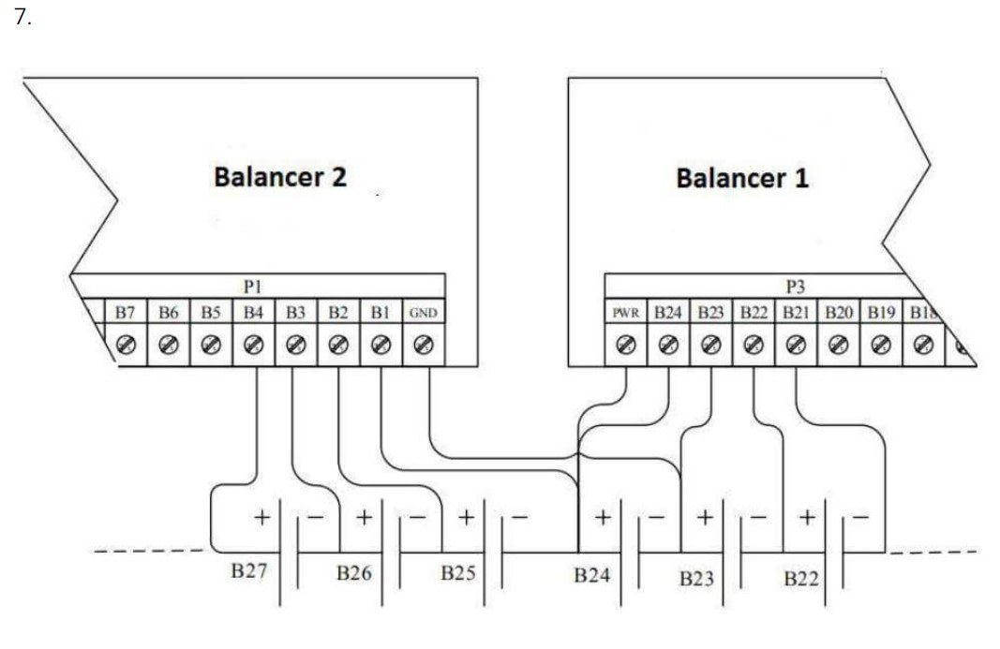
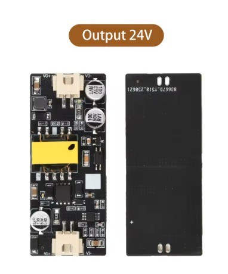
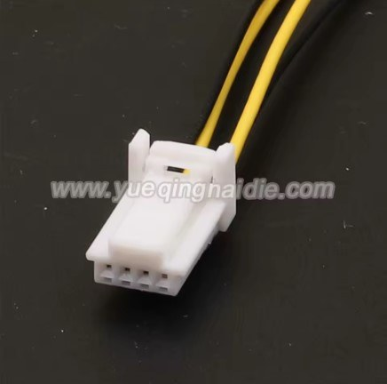

The JIKONG JK-DZ08 active balancers measure and balance the cells of a DIY pack and report over CAN bus. This integration polls up to 15 of them, reads the pack current from a CAB500 CAN current sensor and calculates the state of charge itself by coulomb counting. It presents the pack to the inverter like any other battery.

Supported hardware per pack:

- up to 15 balancers JK-DZ08-BxA24S (2 to 24 cells each), CAN at 250 kbps
- one CAB500 CAN current sensor (LEM CAB500-C/SP5 or an STB-CAB500M-22C clone), 500 A
- a second pack is possible on a separate CAN interface, with its own sensor

### Where do I get the hardware?

- Balancer: [JIKONG JK-DZ08-B2A24S](https://www.aliexpress.com/item/1005008512834934.html), 2 A balancing, built-in CAN
- Current sensor: [LEM CAB500-C/SP5](https://mou.sr/4yPDbDp) or STB-CAB500M-22C (AliExpress)
- Sensor connector: [TE 1612035-1 family 4-pin harness](https://a.aliexpress.com/_EzbfyR8)
- One [isolated DC-DC 12 V to 24 V, 15 W](https://www.aliexpress.com/item/1005010265328330.html) per balancer
- A 120 ohm resistor for the far end of the battery CAN bus

{ width="320" }
{ width="320" }
{ width="260" }
{ width="360" }

## Battery Emulator Configuration

Select `JK Active Balancer (CAB500)` under "Battery" on the Settings page and set the battery CAN interface to the port the balancers are on. The driver runs that port at 250 kbps. The inverter goes on the other port.

A JK section then appears on the Settings page. Every value is read once at boot, so save and reboot. The important ones:

- **Pack layout**: number of cells, cells per balancer, low-voltage mode (parallel packs, one balancer each) or bridge mode (balancers chained in series sharing one tap). Defaults 96 cells, 24 per balancer, series.
- **Firmware version**: 1 = all balancers V11.55, 2 = all V11.56 (default), 3 = mixed with per-balancer boxes. It sets the polarity of the alarm bits; a wrong value shows alarms on healthy balancers.
- **Chemistry and voltage limits**: the LFP box fills NCM or LFP defaults for max/min cell voltage, deviation, pack max/min per cell and the four SOC one-shot voltages. Required order: min cell < empty on < empty off < full off < full on < max cell.
- **Power limits and ramps**: max charge/discharge power in W, charge ramp below SOC max, discharge ramp above the ramp bottom, minimum powers.
- **SOC window and recalibration**: SOC max/min (99 / 1 %), current deadband, rest time and current, recalibration windows.
- **Discharge cut-off hysteresis**: discharge stops below the Target discharge voltage of the main page and resumes this far above it (3.0 V default, use 0.1 V for a few cells).
- **CAB500 variant**: the sensor's CAN ID, CAB500-2 (0x3C2) by default. A second dropdown appears for the second battery.
- **Reverse current sensor direction**: tick if the current reads negative while charging.

On the main page set the battery capacity in Wh (the coulomb counter divides it by the pack maximum voltage), the maximum charge and discharge current, and the **Target discharge voltage** to your pack's cut-off. Its factory default is 300 V, which blocks any pack below that.

!!! note
    Everything that reduces power is visible on the Events page: JK events carry the balancer number or the sensor error code in the Data column.

## Hardware Setup

### Balancers

Wire the tap leads B1 to B24 exactly as the JIKONG manual shows; GND is the negative of the first cell of the group. For a series pack with more than 24 cells the balancers are chained, the top cell of one group being the first tap of the next (bridge mode). For parallel packs each balancer owns one pack (low-voltage mode).

{ width="640" }

In the JIKONG app set each balancer's cell count and give every balancer a unique CAN address 1..N in wiring order. The status page shows the identified and configured cell count per balancer.

Each balancer takes 20 to 100 V on PWR. Instead of the cells, use one isolated 12 V to 24 V converter per balancer: converter plus to PWR, converter minus to the balancer GND. Never share a converter between balancers whose groups are in series.

{ width="220" }

### CAB500 current sensor

{ width="280" }
{ width="220" }

| Pin | Signal | Wire to |
|-----|--------|---------|
| 1 | CAN-L | battery CAN bus CAN-L |
| 2 | CAN-H | battery CAN bus CAN-H |
| 3 | GND | ground of the 12 V supply |
| 4 | Uc | 12 V from the emulator's supply (8 to 16 V allowed) |

Clamp the sensor around one pack cable between the pack and the contactors. New sensors transmit at 500 kbps: once the emulator runs, open the contactors and click **CAB500 to 250 kbps** on the More battery info page. The driver finds the sensor at 500, 250 or 125 kbps, reprograms it over UDS, confirms at the new speed and returns the bus to 250 kbps. Reboot afterwards to clear the comms fault that the silent sensor raised meanwhile.

### CAN bus

One twisted pair from the emulator's battery port along the balancers to the last one, the CAB500 tapped in along the way, CAN ground with it. 120 ohm at the emulator end and at the last balancer. Power the balancers before or together with the emulator: balancer 1 is polled for 10 s after boot, and the driver stops polling if nothing answers in that window.

## Operation

- **Start-up**: nothing is published until every configured cell has reported a voltage. Until then the limits are 0 W and the contactors are not permitted; a 50 % placeholder SOC is shown.
- **SOC**: coulomb counted every 50 ms, corrected by one-shots when the average cell reaches the full or empty voltage, and recalibrated from the voltage table after a rest period near full or empty or inside the recalibration windows. The cycle counter is stored in flash and reduces the capacity by 0.01 % per cycle (shown as SOH); a Reset BMS cycles button is on the status page.
- **Power**: discharge 0 W below the target discharge voltage, otherwise the SOC ramps. Above the cell deviation setting both limits fall linearly to a 50 W floor at setting + 50 mV, with a warning event. At SOC max charge is 0 W, at SOC min discharge is 0 W.
- **Faults, all latched until reboot**: a balancer or the sensor silent for 10 s (a warning is raised after the first missed second), a cell count mismatch or wire resistance alarm present in three consecutive status frames, a CAB500 hardware error flagged for 10 s, or a cell that stops reporting. The system goes to FAULT, the limits to 0 W, and after 10 s in FAULT the contactors open.
- The usual Battery Emulator cell and pack voltage protections apply on top.

## Status page

More battery info shows, per balancer: connection, pack voltage, identified/set cells, cell delta, temperature, balancing state and current, balance switch, communication faults and the two alarms. The CAB500 block shows connection, faults, hardware state with the DTC code, the CAN speed change result and the Ah the coulomb counter works with.

## Troubleshooting

| Symptom | Likely cause | What to do |
|---------|--------------|------------|
| All balancers Disconnected | wrong battery CAN interface, termination, addresses, balancers powered too late | check interface setting, wiring, addresses; power balancers first and reboot |
| Alarms on healthy balancers | wrong firmware version setting | set 1 for V11.55, 2 for V11.56, or 3 with the boxes; reboot |
| CAB500 Disconnected, fault after 40 s | sensor still at 500 kbps, or wiring | CAB500 to 250 kbps button, reboot |
| Current negative while charging | sensor direction | tick Reverse current sensor direction, reboot |
| Discharge 0 W on a charged pack | Target discharge voltage above the pack, or pack inside the hysteresis band | set the real cut-off; lower the hysteresis for small packs |
| SOC jumps to 99 % in seconds or barely moves | battery capacity Wh wrong | enter the real Wh on the main page |
| Everything 0 W, page red | a latched JK fault or a critical cell event | Events page names it; fix, reboot |
