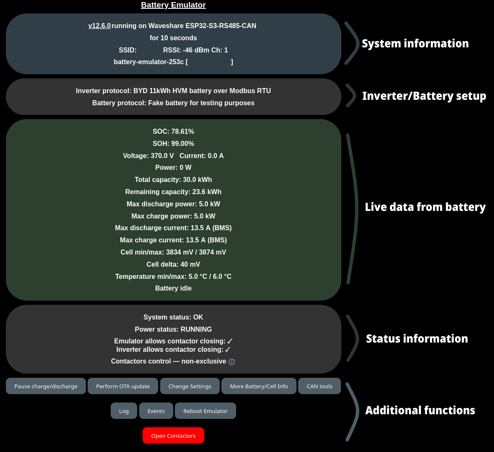
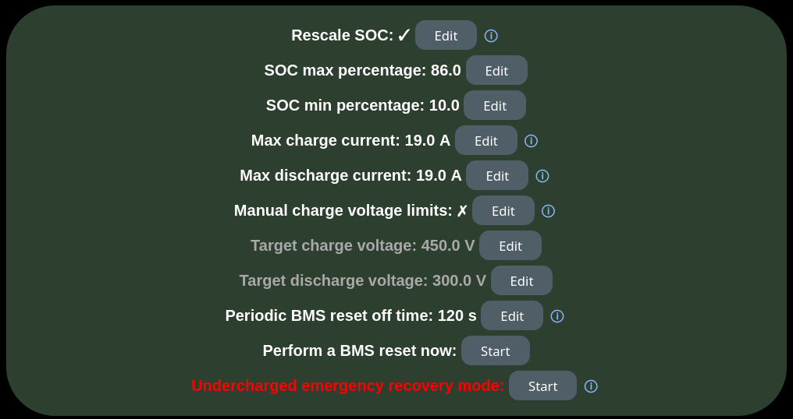
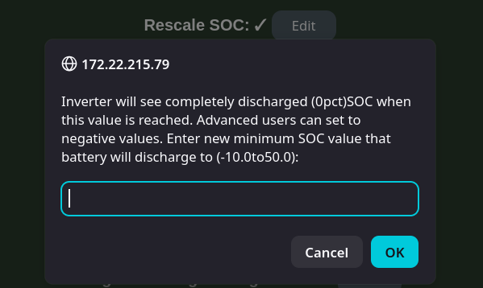
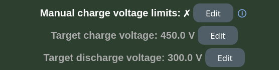
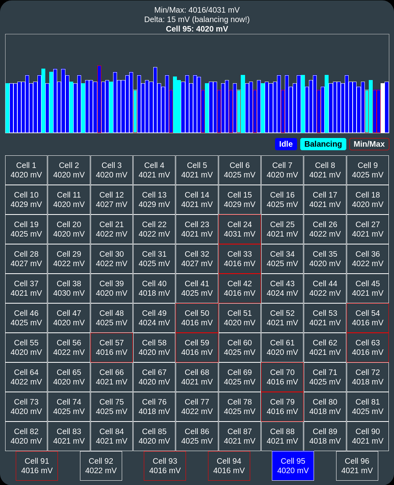
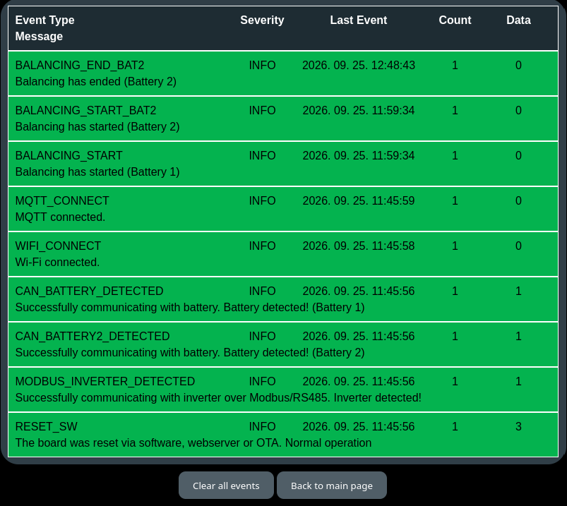

Battery Emulator has a built-in web interface. With it you can check the battery status, change the configuration, update the software over-the-air, check events, monitor the cell voltages and much more. It makes commissioning a new system easy, and it is the preferred way to monitor a newly set up battery.

!!! info "IMPORTANT"
    Never expose Battery Emulator to the internet without a firewall. **Never ever port forward it** to be accessible directly on a WAN port! Use a VPN to the site to access its web interface over an encrypted channel. The web interface uses plain HTTP, so nothing you send to it is encrypted.

## Connecting to the web interface

The web interface is reachable on port 80 of the board, either through your home Wi-Fi network or through the Wi-Fi access point the board broadcasts itself.

Minimum browser requirements:

| Browser | Minimum version required |
|---|---|
| Chrome / Chrome Android / Android WebView | 80 (2020) |
| Edge | 80 (2020) |
| Firefox / Firefox Android | 74 / 79 (2020) |
| Safari desktop / iOS | 14 / 14 (2020) |
| Samsung Internet | 13.0 |

### A: Through your home network

To have Battery Emulator accessible in your home network, enter your home Wi-Fi credentials in the [Network config](#network-config) section of the Settings page. See the [installation steps](../firststeps.md#how-to-install-the-software) for how to perform the initial Wi-Fi setup.

!!! note "NOTE"
    Only 2.4 GHz networks are compatible, 5 GHz will NOT work! The network must be password protected: the SSID can be at most 32 characters long (the limit of the Wi-Fi standard), and the password must be 8-63 characters long.

When the board boots, it will attempt to connect to the Wi-Fi network you specified. When several access points broadcast the same SSID (mesh or multi-AP networks), it always joins the one with the strongest signal. Your router will give it an IP address (unless you set a [static IP](#network-config)), so next up is figuring out what that address is. There are a few options:

- Connect temporarily to the Battery Emulator's [access point](#b-through-the-access-point), browse to [192.168.4.1](http://192.168.4.1), and read out the address it got at the top of the [main page](#system-information) (hostname followed by the IP in square brackets)
- Browse to `http://battery-emulator-a1b2.local` (with the board's own hostname). This mDNS address works on all boards except the [small flash boards](../../hardware/index.md#small-flash-boards), and if your network and computer support mDNS.
- Check your router. If your home router has a login page (typically 192.168.1.1), you can see the devices connected to your home network there. The board shows up as `battery-emulator-a1b2` (or the custom hostname you set) in its DHCP leases table.
- Connect via USB and read out the serial output with a serial terminal at **115200 baud** (if you only see `?????` in the terminal, the baud rate is wrong). When the board joins the network it prints the line `Got IP address: ...`. The board only prints to USB when [General logging via USB serial](#usb-serial) is enabled.

Once the address of the board has been determined, open a web browser on a device that is connected to the same home network, and type in the address. This opens the main page of the web interface.

### B: Through the access point

By default, the board broadcasts a Wi-Fi access point (AP) with the SSID `battery-emulator-a1b2` (containing the last two bytes of its MAC address). If you set a custom **Hostname**, the access point takes that name instead. The default password is `123456789`. After connecting your laptop/phone to this network, open a web browser and browse to [192.168.4.1](http://192.168.4.1).

You have to change the access point password in the [Network config](#network-config) to improve cyber-security: while the access point is running with the factory-default password, it is automatically switched off after 5 minutes, raising a corresponding event. It is not switched off while a device is connected to it, and it gets a new 5 minute window after every reboot. If a custom access point password has been set, it stays enabled indefinitely. The default-password access point being limited to a short provisioning window mitigates the attack vector while keeping first-time setup and recovery access fully functional.

If a home network is configured but the board can’t join it after booting (wrong password, network out of range), the access point is brought up automatically as a rescue path, even if it’s disabled in the settings. This lasts for that boot only; the setting itself isn’t changed, and with the default password it will be up for 5 minutes as described above.

If you don't plan to use the access point on a regular basis, disable it with **Broadcast Wi-Fi Access Point**. Not only will the system be more secure, it will also consume less energy and the board will run 10 degrees cooler, because the radio will not be transmitting continuously. Bonus: less radio interference.

!!! tip "TIP"
    If you disabled the access point earlier and need to use it again without having access to the home network, you can [turn it back on with the BOOT button](boot_button_functions.md#start-wi-fi-access-point) on the board.

!!! note "NOTE"
    Make sure that your home network is not on `192.168.4.x`, since this conflicts with the built-in access point.

## Pages at a glance

| Page | Address | How to get there | What it is for |
|---|---|---|---|
| [Main page](#main-page) | `/` | Start page | Live status of the system, control buttons |
| [Settings](#settings) | `/settings` | **Change Settings** | All configuration |
| [More battery info](#more-battery-info) | `/advanced` | **More Battery/Cell Info** | Battery specific details, DTCs, battery commands |
| [Cellmonitor](#cellmonitor) | `/cellmonitor` | **Cellmonitor** on the More battery info page | Cell voltages and balancing |
| [CAN tools](#can-tools) | `/canreplay` | **CAN tools** | CAN dump and CAN replay |
| [Log](#log) | `/log` | **Log** (only when logging to the Webserver or to SD card is enabled) | General log |
| [Events](#events) | `/events` | **Events**, or **Inspect reason** next to a FAULT | What happened since boot |
| [OTA update](#ota-update) | `/update` | **Perform OTA update** | Firmware update |

## Main page

The main page gives a quick overview of the system in a couple of cards, with buttons to the other pages and functions below them.

The title **Battery Emulator** at the top links to this wiki. On release builds the browser also checks GitHub for a newer release (at most every 6 hours) and shows a **New version ... available** link under the title when there is one.

### System information

- The software version (on official release and pull request builds it links to the release or the pull request on GitHub), the hardware it is running on and, if [Measure CPU temperature](#hardware-config) is enabled, the CPU temperature
- The uptime ("for 2 days, 5 hours, 12 minutes")
- If [Performance profiling on main page](#debug-options) is enabled: free heap, flash mode and size, and task timing figures. These are meant for developers.
- The SSID of the home network, with the signal strength (RSSI) and Wi-Fi channel when connected
- The hostname and the IP address in square brackets. While [ESPNow](espnow.md) is running, the board's MAC address is shown after the IP, which is the address to enter in the receiver list of other ESPNow nodes. When not connected to any network, **Network state: Disconnected** is shown instead.
- **Access Point active** and its IP, while the access point is running

### Inverter and battery setup

The configured **Inverter protocol**, **Battery protocol** (marked ② or ③ for a [double](battery_2x.md) or [triple](battery_3x.md) battery setup, and (LFP) for LFP chemistry), the optional current **Measurement** device (for the [QNHCK2-16](../hardware/shunt_qnhck2_16.md#configuration), a ✓ means its current is the one in use) and the optional **Charger protocol**.

### Battery cards

The live data of the battery, as transmitted to the inverter: SOC, SOH (**Unknown** until the battery has reported it), voltage, current, power, total and remaining capacity, the maximum charge and discharge power and current allowed, the lowest and highest cell voltage and the difference between them (**Cell delta**, shown red if it exceeds what the battery integration considers safe), the minimum and maximum temperature, and finally whether the battery is charging, discharging or idle. Some integrations also show the state of the battery's BMS (**Battery BMS status**).

With [Rescale SOC](#rescale-soc) active, **Scaled SOC**, **Scaled total capacity** and **Scaled remaining capacity** are shown, with the real values in brackets.

The colour of the card shows the state of the system:

| Colour | Meaning |
|---|---|
| 🟩 Dark green | All is well |
| 🟨 Yellow | A warning event is active |
| 🟥 Red | An error event is active, operation is blocked |
| 🟦 Blue | A reboot or firmware update is in progress |

When there is a warning or an error, check the [Events](#events) page to see what went wrong. The [status LED](../../hardware/index.md#status-led) of the board follows the same colours.

With a [double](battery_2x.md) or [triple](battery_3x.md) battery setup, a combined card on top shows the whole installation, which is what the inverter sees, and one card per battery pack below it shows that pack's own data, unscaled, with the power limits its own BMS asked for. See [How the packs become one virtual battery](battery_2x.md#how-the-packs-become-one-virtual-battery) for details.

Next to the **Max discharge current** and **Max charge current** you can see what is setting the limit:

- **(BMS)**: the limit requested by the battery
- **(Manual)**: the [Max charge/discharge current](#battery-chargedischarge-limit) set on the Settings page, because it is lower than what the battery allows
- **(Remote)**: a temporary limit set through [MQTT SET_LIMITS](mqtt.md#set_limits)

While an [equipment stop](equipment_stop.md) is active, the limits are shown in red.

#### Limiting factor display

The last line of the card shows which component is limiting the charge/discharge:

- **(Inverter limiting)**: the current flowing is lower than what the system allows, so the inverter is the bottleneck
- **(Settings limiting)**: the current is capped by the [Max charge/discharge current](#battery-chargedischarge-limit) setting
- **(Battery limiting)**: the current is at the limit the battery allows

If no current is flowing in or out of the battery, the text simply says **Battery idle**.

### System status

- **System status**: OK, STANDBY, INACTIVE, UPDATING or FAULT. Next to a FAULT, an **Inspect reason** button opens the [Events](#events) page.
- **Power status**: RUNNING, or in red PAUSING, PAUSED or RESUMING (see [Pause charge/discharge](#buttons))
- **Emulator allows contactor closing**: ✗ while there is a FAULT
- **Inverter allows contactor closing**: whether the inverter permits closing the contactors (for inverter protocols that control the battery contactors)
- **2ⁿᵈ / 3ʳᵈ battery allowed to join**: ✗ (voltage mismatch) while the voltage of the extra pack differs too much from the main battery to connect it in parallel
- **Contactors control**: when Battery Emulator drives the contactors itself ([contactor control via GPIO](contactor_control_via_gpio_pins.md)), the state of the contactors: OFF (DISCONNECTED), PRECHARGE, ON (or **Economized** with [PWM control](contactor_control_via_gpio_pins.md#pwm-control-for-lower-power-draw)), or OFF (FAULT), which needs a reboot to recover from. Otherwise it shows **non-exclusive**: the contactors are controlled via CAN or other methods, and Battery Emulator has only limited influence over them.

If a [charger](../chargers/index.md) is configured, an 🟧 orange card shows its state and output values.

### Buttons

- **Pause charge/discharge**: after a confirmation, sets the maximum charge and discharge power to zero, preventing any further power flow. It does not open the contactors. The **Power status** shows PAUSING until the current has dropped below 1.8 A on every battery, then PAUSED. The button changes to **Resume charge/discharge**. The pause is not remembered across a reboot.
- **Perform OTA update**: opens the [OTA update](#ota-update) page.
- **Change Settings**: opens the [Settings](#settings) page.
- **More Battery/Cell Info**: opens the [More battery info](#more-battery-info) page.
- **CAN tools**: opens the [CAN tools](#can-tools) page.
- **Log**: opens the [Log](#log) page. Only shown when **General logging via Webserver** or **General logging to SD card** was enabled when the board booted.
- **Events**: opens the [Events](#events) page.
- **Reboot Emulator**: restarts Battery Emulator, after a confirmation. See [Reboot](#reboot).
- **Logout**: only shown when [password protection](#web-server-authentication) is enabled. Afterwards, cancel the browser's login prompt to finish logging out.
- **Open Contactors** (red): after a confirmation, activates an [equipment stop](equipment_stop.md#what-is-equipment-stop), exactly as a physical equipment stop button would. It is stored, so it stays active after a reboot. While it is active the button changes to **Close Contactors** (green), which releases the stop and enables power transfer again.

### Reboot

**Reboot Emulator** restarts Battery Emulator. This can be useful to get out of a latched error blocking operation (critical cell condition, etc.). The emulator first pauses charging and discharging, and restarts once the current has stopped, after 5 to 10 seconds. The main page shows **Waiting for the emulator to restart** meanwhile, and reloads itself when the emulator is back.

!!! note "NOTE"
    Rebooting the Emulator might open contactors! If you have configured the hardware to control contactors via GPIO (see [Automatic Contactor Control](contactor_control_via_gpio_pins.md)), they will absolutely open during a reboot! CAN controlled contactors have undefined behavior during reboot.

!!! note "NOTE"
    Rebooting the Emulator might put your inverter in a fault state. Some inverters take the reboot without any issues (Fronius Gen24), but others can properly lock themselves (SMA Tripower), and require a reset on the inverter side to get going again.

### Automatic refresh

The main page refreshes its data from the Emulator every 15 s, without reloading the whole page. Clicking or tapping any of the data cards triggers an instant refresh (the data dims briefly to acknowledge it). The maximum refresh rate allowed is 1 s, but please, don't abuse it. A browser tab in the background does not refresh at all, it catches up as soon as it is shown again.

If a refresh fails, the page keeps the data it shows and retries every 5 seconds. From the second failure in a row the data is dimmed and the reason is displayed, so outdated values never pass for fresh ones:

The page recovers automatically as soon as the connection is reestablished. When it notices that the emulator has restarted in the meantime (a reboot or an OTA update), it reloads itself completely, so it always matches the running firmware.

## Settings

The Settings page holds all the configuration of Battery Emulator. It is made of two parts:

- **The settings form** (the cards from Network config to Debug options). Changes made here are stored by the **Save** button at the bottom of the page, and most of them take effect only after a reboot: after saving, the message **Settings saved. Reboot to take the new settings into use.** appears at the top and at the bottom of the page, with a **Reboot** button.
- **The battery limits and actions** below the form (the green card, starting with Rescale SOC). These are changed one by one with their **Edit** or **Start** buttons, are stored right away and take effect immediately, without a reboot. See [Battery limits and actions](#battery-limits-and-actions).

Most fields only appear when they are relevant: options of a specific battery, inverter or component appear when that one is selected, and the details of an option appear once it is ticked. Below the form, a grey card shows the interfaces the running battery, inverter and measurement device use.

When saving, the page checks your input: the browser marks fields with an invalid format, and saving is refused if two batteries are assigned to the same CAN interface (each battery needs a CAN interface of its own, only the [Fake battery](../../battery/fake_battery.md) can share one), or if the web interface passwords don't match.

The **Factory reset** button at the top of the page erases all stored settings and the Wi-Fi calibration data, and restarts the board. It then comes back up like a newly flashed board: with no home network configured and with its access point running with the default password. The same can be done with the [BOOT button](boot_button_functions.md#factory-reset).

!!! tip "TIP"
    Settings are kept across [OTA updates](ota_update.md), you don't have to configure the system again after updating.

### Help texts

The Settings page contains an embedded help, with short explanations about the configuration items. Click or tap the small ⓘ icon next to an item, where available, to display the information, and again to close it. Links in the help texts point to the wiki pages documenting the item, and open in a new window. When the browser rejects the format of a value on saving, the help of that field opens by itself, showing the format rule. The same ⓘ icons are used on the main page, the CAN tools page and the More battery info page too.

The texts are fetched from GitHub by the browser and cached for an hour, so they are always up to date, even with older firmware. Boards with enough flash also carry the texts as they were when the firmware was built, which is used when GitHub cannot be reached (for example when connected only to the board's access point).

!!! note "NOTE"
    On the [small flash boards](../../hardware/index.md#small-flash-boards) (LilyGo T-CAN485, ESP32 DevKit) the help is shown only when the browser has Internet access, or has a copy cached from a previous visit.

### Network config

| Setting | Description |
|---|---|
| **SSID** | The name of your home Wi-Fi network, up to 32 characters |
| **Password** | The password of your home Wi-Fi network, 8-63 characters. The stored password is never shown, leave the field blank to keep it. |
| **Hostname** | Letters, numbers, `_` and `-`. Leave it blank to use the default `battery-emulator-a1b2`. It is also the SSID of the access point, the mDNS name and the [MQTT](mqtt.md) topic name. As it is used as the SSID, keep it within 32 characters. |
| **Use static IP address** | Use fixed addresses instead of the ones given by your router's DHCP server. Ticking it while the board is connected fills in the addresses currently in use, so making the current address permanent is just a matter of saving. Fill in **Local IP**, **Gateway** and **Subnet mask**; leave **DNS server** blank to use the gateway, which is correct on most home networks. If the addresses are invalid, the board falls back to DHCP. |
| **Broadcast Wi-Fi Access Point** | Enabled by default. See [B: Through the access point](#b-through-the-access-point). |
| **Access Point password** | 8-63 characters, leave it blank to keep the current one. Change it from the default `123456789`! |
| **Wifi channel 0-14** | Force a specific Wi-Fi channel, 0 (default) finds it automatically |

### Web interface access { #web-server-authentication }

Tick **Enable password protection** and set a **Username** (`admin` by default, up to 32 characters) and a **Web interface password** (up to 63 characters, entered twice) to require a login for all the pages, including the OTA update page. Saving is refused if the username or the password is missing. The protection takes effect after a reboot, and a **Logout** button appears on the main page.

The login uses HTTP Basic authentication. This protection level is not particularly robust: the username and the password are only encoded, not encrypted, and they are sent with every request over plain HTTP, so anyone able to watch your network traffic can read them. It is sufficient to prevent non-malicious usage within the internal network on which it operates, but it is no replacement for keeping the device off the internet.

!!! note "NOTE"
    If you forget the password, a [factory reset with the BOOT button](boot_button_functions.md#factory-reset) clears it, together with all other settings.

### Battery config

{ width="570" height="164" }

Select the integration of your battery from the **Battery** dropdown list, and the **Battery interface** the battery is wired to. Each battery has its own [page in this wiki](../../battery/index.md) with the wiring and the settings it needs. **Battery chemistry** sets the cell chemistry the system assumes; integrations that know the chemistry of their battery override it.

An interesting type is the [Fake battery for testing purposes](../../battery/fake_battery.md), which simulates a single, double or triple battery towards the inverter and the integration platforms. Its voltage and SOH are set for each pack on the [More battery info](#more-battery-info) page.

Depending on the battery selected, more options appear:

| Option | Shown for | Description |
|---|---|---|
| **BMS starting sequence request**, **Automatic current offset correction**, **Interlock required** | Nissan LEAF | See [Nissan LEAF software configuration](../../battery/nissan_leaf_e_nv200.md#software-configuration). Changing the starting sequence request offers to reset the BMS right away, as the BMS only reads it while starting up. |
| **Digital HVIL (2024+)**, **Right hand drive**, **Country code**, **Map region**, **Chassis type**, **Pack type** | Tesla Model 3/Y, Tesla Model S/X | See [Tesla Model 3/Y](../../battery/tesla_model_3_y.md#software-configuration) |
| Power limits | Daly BMS | See [Daly BMS configuration](../../battery/bms/daly_smartbms.md#battery-emulator-configuration) |
| **Manual charging power, watt**, **Manual discharge power, watt** | Integrations whose battery does not report usable power limits | The continuous charge and discharge power allowed. Do not set them too high! |
| **Use estimated SOC** | Some integrations | Use an estimated SOC when the battery does not provide an accurate one |
| **Use estimated charge limits** | Some integrations | Use the manual charge/discharge power when the battery does not report usable limits |
| **Battery max/min design voltage (V)**, **Cell max/min design voltage (mV)** | BMS type integrations (Orion, SIMPBMS, Daly, RJXZS etc.) and some others | The safe voltage range of the whole pack and of a single cell, used as charge target and protection limits |
| **Pylon CAN baudrate (kbps)** | Pylon HV battery | 500 kbps for most batteries, 250 kbps for some |
| **Double battery** with **2ⁿᵈ interface**, then **Triple battery** with **3ʳᵈ interface** | Integrations that support [double](battery_2x.md) or [triple](battery_3x.md) batteries | Run two or three packs in parallel, each on a CAN interface of its own |

### Inverter config { #inverter-config }

{ width="573" height="247" }

Select the **Inverter protocol** the Emulator should talk to your inverter with, and the **Inverter interface** it is wired to. Each supported inverter has its own [page in this wiki](../../inverter/index.md) explaining which protocol to choose.

Depending on the protocol selected, more options appear right below:

| Option | Shown for | Description |
|---|---|---|
| **Sofar Battery ID (0-15)** | Sofar | Battery ID, for running several packs in parallel. See [Sofar](../../inverter/sofar.md) |
| **Pylon, send group**, **30k offset**, **invert byteorder**, **manufacturer name** | Pylon HV | Compatibility options needed by some inverters using this protocol, for example [Sofar](../../inverter/sofar.md#which-protocol-to-use), [Hoymiles](../../inverter/hoymiles.md) or [Deye](../../inverter/deye.md#note-on-pylon) |
| **Deye avoid over/undercharge fix** | BYD CAN | See [Deye](../../inverter/deye.md#notes-on-protocol-violation) |
| **Accept reboot command from inverter**, **Fronius Primo, 450V maxvoltage cap**, **WatchDog Timeout**, **Inverter time (UTC)** | BYD Modbus | See [Fronius](../../inverter/fronius.md#other-settings). The last two only display what the inverter has sent. |
| **Reported cell count**, **module count**, **cells per module**, **voltage level**, **Ah capacity** | Ferroamp, Pylon HV, Solxpow (module count also Solax) | Override what is reported to the inverter, 0 keeps the default |
| **Reported battery type** | Solax | See [Solax battery type information](../../inverter/solax.md#battery-type-information-2026) |
| **FoxESS battery type**, **subtype**, **module count** | FoxESS | Override what is reported to the inverter, 0 keeps the default |
| **Battery model** | Sungrow | See [Sungrow SBRXXX protocol](../../inverter/sungrow.md#sungrow-sbrxxx-protocol) |
| **Inverter Contactor Workaround** | Kostal, Solax | See [Notes on CAN controlled contactors](../../inverter/solax.md#notes-on-can-controlled-contactors) |

The following options apply to all inverters:

**Ramp up charge limits gradually** smooths sudden increases in the battery's charge and discharge power limits before sending them to the inverter to prevent oscillation, using a low pass filter in the software. An increase closes 10% of the remaining gap every second, a time constant of about 10 seconds, while a decrease is passed on immediately.

**Charge power tapering based on SOC** gradually reduces the allowed charge power when approaching the top of the SOC window, from full allowed power down to 0 W at 100% SOC, for a smooth approach to full instead of an abrupt cutoff. It works on the SOC the inverter sees, so it follows [Rescale SOC](#rescale-soc) when that is active. It has two settings:

- **Start tapering at SOC, percent** (50-99, default 95): the (scaled) SOC where charge power tapering begins.
- **Float charge power, W** (0-2000, default 400): the minimum charge power held during tapering until 100% SOC is reached. Recommended to set it to 5-10% of the inverter's max power for a single battery (for double and triple, you can increase the value accordingly). 0 disables this, tapering will go linearly to 0 W. It is never applied when the battery or the safety layer itself allows no charging.

The log shows a line when tapering engages. Both options can be used on their own or together.

!!! info "IMPORTANT"
    Remember to set [Max charge current and Max discharge current](#battery-chargedischarge-limit) correctly to match your setup for these options to work properly! Both options start from the power these limits allow.

!!! note "NOTE"
    For certain battery integrations tapering is mandatory: the checkbox is shown ticked and greyed out, and the start SOC is limited to 50-85%.

**Allow longer CAN timeout**: an inverter communicating over CAN is reported missing after 60 seconds without messages from it. This option triples the timeout to 180 seconds, for inverters that are slow to start up.

**Inverter run entirely offgrid**: when the inverter is missing, an error event is normally raised, which stops the battery from starting. With this option enabled, that event is raised as a warning instead, for installations where the inverter is not connected to the grid.

### Optional components config

| Setting | Description |
|---|---|
| **Charger** and **Charger interface** | An optional HV charger controlled by the Emulator. See [Chargers](../chargers/index.md) and [Charger settings](#charger-settings). |
| **Measurement** and **Interface** | An optional current measurement device: a [BMW SBox](../../battery/bms/shunt_bmw_sbox.md), the [QNHCK2-16 DC current clamp](../hardware/shunt_qnhck2_16.md#configuration), the CT clamp of a [CHAdeMO](../../battery/wip/chademo_vehicle.md) setup (**Custom Clamp**), or the current measured by the inverter (**Using inverter values**, only for the BYD CAN inverter protocol). Only the types usable with the selected battery and inverter are listed. |

### Hardware config

| Setting | Description |
|---|---|
| **Equipment stop button** | The type of the optional equipment stop button. See [Equipment stop](equipment_stop.md#software-setup). |
| **Contactor control via GPIO**, **Precharge time ms**, **Use Normally Closed logic** | See [Contactor control via GPIO](contactor_control_via_gpio_pins.md#software-setup) |
| **2ⁿᵈ / 3ʳᵈ battery contactor control via GPIO** | See [Double battery](battery_2x.md#gpio-controlled-contactors) |
| **PWM contactor control**, **PWM Frequency Hz**, **PWM Hold** | See [PWM control](contactor_control_via_gpio_pins.md#pwm-control-for-lower-power-draw) |
| **Periodic BMS reset**, **Every**, **Defer reset if SOC less than 15%**, **Skip reset for one period if balancing** | See [Periodic BMS reset](../hardware/periodic_bms_reset.md#timed-trigger) |
| **External precharge via HIA4V1** and its options | See [External precharge](../hardware/high_voltage_source.md#software-configuration) |
| **Measure CPU temperature**, **CPU temperature calibration offset (°C)** | Shows the CPU temperature on the main page. The reading of the internal sensor can be corrected with an offset, measured with a separate thermometer. |
| **Status LED pattern** | How the [status LED](../../hardware/index.md#status-led) animates: **Classic** pulses steadily, **Energy Flow** pulses differently while charging, discharging or idle, **Heartbeat** beats faster on a warning or an error. The LilyGo T-2CAN also offers GRB versions, for LEDs with a different colour order. |
| Board specific pin options | **Configurable port** on the [LilyGo T-2CAN](../../hardware/lilygo_t_2can.md), **BMS Power pin**, **SMA enable pin** and **µSD Slot** on the [LilyGo T-CAN485](../../hardware/lilygo_t_can485.md), **BMS Power pin** on the [Stark CMR](../../hardware/stark_cmr.md), **GPIO 1/2 function** on the [Waveshare](../../hardware/waveshare_esp32_s3_rs485_can.md). See the page of your board. |

### Integration settings

| Setting | Description |
|---|---|
| **Start ESPNow at boot**, **ESPNow receiver MACs** | See [ESPNow](espnow.md#enabling-it) |
| **Enable MQTT** and its options | See [MQTT](mqtt.md#enabling-mqtt) |
| **Allow remote BMS reset via MQTT** | See [Periodic BMS reset](../hardware/periodic_bms_reset.md#remote-trigger-through-mqtt) |
| **Home Assistant autodiscovery** and its options | See [Home Assistant Discovery](mqtt.md#home-assistant-discovery) |

### Debug options

**Performance profiling on main page** shows detailed performance metrics on the [main page](#system-information). Only needed when asked by developers.

The other options control where the logs go. Battery Emulator keeps two independent log streams: **general logging** (human-readable status/debug text) and **CAN message logging** (the raw bus traffic, see [CAN logging](../can_related/can_logging.md)). General logging can be sent to the webserver [Log](#log) page, to USB serial, to an SD card and to a remote syslog server, while CAN message logging can be written to USB serial or to an SD card. The webserver and USB serial general logging exclude each other: ticking one unticks the other. Every general log line sent to the webserver, USB or SD card is prefixed with the uptime (`seconds.milliseconds`).

!!! note "NOTE"
    Logging is entirely optional and off by default. Enable only the destinations you actually need — each one adds processing overhead, and USB serial in particular is best left off during normal operation. Like the other settings, they take effect after a reboot.

#### USB serial

**General logging via USB serial** and **CAN message logging via USB serial** stream the log live over the USB cable. Open a serial terminal on the connected computer at **115200 baud** to watch it in real time. This is the quickest way to see what the board is doing during bring-up, but it is also the heaviest option.

!!! warning "WARNING"
    USB serial logging causes performance issues and should be avoided if possible — especially CAN message logging, which prints every incoming and outgoing frame.

#### SD card

On the boards with a µSD slot ([LilyGo T-CAN485](../../hardware/lilygo_t_can485.md) and [DFRobot Edge101](../../hardware/dfrobot_edge101.md)), **General logging to SD card** and **CAN message logging to SD card** persist the logs across reboots. Entries are buffered in RAM and written to two files in the card root: general logging to **`/log.txt`** and CAN traffic to **`/canlog.txt`**. You can download or delete these files from the browser: the general log with the **Export to .txt** and **Delete log file** buttons of the [Log](#log) page, and the CAN log with the **Export SD card CAN log** and **Delete SD card CAN log** buttons of the [CAN tools](#can-tools) page. Because it survives power cycles, SD logging is the best option for catching an intermittent fault that only shows up after hours of running.

!!! note "NOTE"
    On the LilyGo T-CAN485, the **µSD Slot** setting in Hardware config must be set to µSD Card (the default). CAN-to-SD logging is high-volume and adds load, so enable it only while actively troubleshooting.

#### Remote syslog

**General logging to syslog server** forwards each general log line as a UDP **syslog** datagram in **RFC 5424** format to a server of your choice — handy for aggregating logs from a permanently installed system into an existing logging/monitoring setup. Configure the **Syslog server** (IP address or hostname), the **Syslog UDP port** (default 514) and the **Syslog facility** (0–23, default 1 = user).

Each line is tagged with a syslog **severity**: lines that originate from an event carry that event's level (error → *err*, warning → *warning*, firmware update → *notice*, info → *info*), milestones such as detecting the battery or the inverter, MQTT connecting or disconnecting, Wi-Fi getting an IP address or disconnecting, BMS resets and the reason of the last reset are raised to *notice*, and all other lines are sent as *debug* unless the firmware marks them otherwise. The datagram carries the board's hostname, and as APP-NAME the task of the firmware that produced the line. The timestamp field is left empty (NILVALUE `-`), so the receiving syslog server stamps each message on arrival.

Datagrams are sent while the board is connected to the home network, or while a device is connected to its access point. Lines logged before that, for example during boot or while the network connection briefly drops, are kept in a 4 KB backlog and sent in a batch once the connection is up, each prefixed with the uptime it was logged at (`[boot +12.345s]`). If the backlog fills up, the earliest lines are kept and a warning reports how many lines were dropped.

!!! tip "TIP"
    If you own a Synology NAS, in the Log Center set up a Log Receiving entry in **IETF** format.

#### CAN logging

See the page about [CAN logging](../can_related/can_logging.md) for more information about the CAN logging function.

### Battery limits and actions

These values are changed with their **Edit** button, which asks for the new value. They are stored and take effect immediately, no saving or reboot is needed. The ⓘ icons explain them on the page.

#### Battery capacity

How much energy can your battery store? Some batteries autodetect this via CAN communication, this setting is invisible for them, but for battery types that do not, it is good to manually define the value (1-400000 Wh, default 30000) so that your inverter knows how large the battery is.

#### Rescale SOC

If enabled, the system rescales the SOC% between the configured **SOC min percentage** (-10 to 50, default 20) and **SOC max percentage** (50 to 100, default 80): the inverter sees 0% when the real SOC reaches the minimum, and 100% when it reaches the maximum. By not using the entire battery, the amount of cycles the battery can last increases. Good practice is to use this feature, and restrict SOC% between 20-80%, however, scaling SOC max too low may cause oscillations when charge approaches the scaled 100%. If you run into this, enable [Ramp up charge limits gradually](#inverter-config) in **Inverter config** and raise SOC max percentage to 100%.

For [double](battery_2x.md) and [triple](battery_3x.md) setups SOC scaling is applied once, to the installation aggregated total, per-pack values remain unchanged. The scaling can also be changed through [MQTT](mqtt.md#set_scalesoc).

!!! note "Chemistry"
    For some battery chemistries (LFP especially), rescaling SOC% prevents the battery from top-balancing properly. For these chemistries it is recommended to rescale only the bottom section with **SOC min percentage** (e.g. using 20-100%).
    
    For batteries of NMC chemistries it's specifically advised against habitual full charging, which adds wear - thus, for longer lifetime, you should set **SOC max percentage** to around **80** on long term (during the summer, when the pack charges to full quickly, and then stays full almost all day).

!!! tip "Negative rescaling"
    It is also possible to do negative rescaling, as some inverters restrict the possibility to use the entire battery capacity at the bottom section. With this trick you can circumvent that. Use with caution!

#### Max charge/discharge current { #battery-chargedischarge-limit }

- Max charge current (A)
- Max discharge current (A)

These settings cap the current that can go in/out of the battery (0-1000 A). Even though most EV packs can push out hundreds of ampere, most inverters will not handle so large amounts of current. Some inverters even stop functioning in case they see allowed a large value. By default this is set to 30 A on charge and discharge. Set this value to correspond to the parameters of your inverter (Inverter Power / Vmin), the wiring or the fuses in your system (whichever the lowest). It is important for these numbers to be correct, in order for the [filter and the taper](#inverter-config) to operate correctly. When this setting is what limits the current, the main page shows [(Manual)](#battery-cards) next to the limit.

!!! tip "Example"
    If you have a 3 kW inverter, the max charge/discharge current would be 3000 W / 300 Vmin = 10 A

#### Manual charge voltage limits

Disabled by default. This option can be enabled to manually limit the min/max voltage in the system, with **Target charge voltage** (default 450.0 V) and **Target discharge voltage** (default 300.0 V). Note that not all inverters are compatible with voltage based limits, the setting was primarily developed for BYD CAN (see for example [Deye](../../inverter/deye.md#manual-charge-voltage-limits)). If left disabled, the system will automatically use the entire voltage range of your battery (unless Rescale SOC is enabled).

#### Periodic BMS reset

**Periodic BMS reset off time** (1-600 s, default 30) sets how long the BMS stays powered off during a reset, and **Perform a BMS reset now** starts a reset on demand. Both are shown when **Periodic BMS reset** or **Allow remote BMS reset via MQTT** is enabled. See the dedicated page for [Periodic BMS reset](../hardware/periodic_bms_reset.md#on-demand-trigger).

#### Undercharged emergency recovery mode

See the dedicated page for [Recovering undercharged battery](../hardware/recovering_undercharged_battery.md).

### Manual LFP balancing

Only shown for the Tesla Model 3/Y and Model S/X integrations: when enabled, forces a top charge for at most **Balancing max time**, at **Balancing float power**, with temporarily raised limits for the pack voltage, cell voltage and cell deviation, to help keep LFP batteries balanced. It is meant to be done about once a month, with the battery fully charged first. See [Periodic forced charge-balancing](../../battery/tesla_model_3_y.md#periodic-forced-charge-balancing-can-potentially-aid-to-balance-lfp).

### Charger settings

Only shown when a [charger](../chargers/index.md) is configured: **Charger HVDC Enabled** and **Charger Aux12VDC Enabled** switch the high voltage and the 12 V outputs of the charger on and off, while **Charger Voltage Setpoint** and **Charger Current Setpoint** set its charging target. The setpoints are checked against the limits of the charger.

## More battery info

The **More Battery/Cell Info** button of the main page opens a page with detailed information about the battery that is specific to the battery integration: its current status, health and lifetime usage, as the battery reports them. See the page of your [battery](../../battery/index.md) for what is shown. The page does not refresh itself; reload it to see new values. With a [double](battery_2x.md) or [triple](battery_3x.md) battery setup, tabs at the top select the battery. 

Some battery packs show the stored **Diagnostic Trouble Codes**, which are read on demand with **Read DTC**, and can be cleared with **Erase DTC**. Each code is shown with its status (Active, Confirmed or Stored) and a description, fetched from GitHub (boards with enough flash also carry the descriptions built in).

Depending on what the battery supports, buttons below the information offer battery commands, for example clearing an isolation fault, resetting or calibrating the SOC, resetting the BMS or its degradation data, starting or stopping balancing, or opening and closing the contactors. Commands that change something in the battery ask for a confirmation before they are sent.

The **Cellmonitor** button opens the [Cellmonitor](#cellmonitor) page, showing the same battery.

## Cellmonitor

The Cellmonitor visualizes all the cells in your battery. At the top there is a quick readout of the lowest and highest cell voltage (**Min/Max**) and the difference between them (**Delta**). The graph gives a quick visualization of how balanced the battery is, with a grid view of all cells and their values below it. The cells that are lowest and highest are highlighted with a red border for quicker identification of where they are, and cells below 3000 mV are written in red.

Click or tap a bar or a cell to select it: its number and voltage are shown above the graph. On a touch screen you can slide your finger along the graph to scrub through the cells. The page refreshes the values every 20 seconds and keeps the selection. With a [double](battery_2x.md) or [triple](battery_3x.md) battery setup, tabs at the top select the battery.

### Interpreting the values

In general, the lower the voltage deviation in mV, the better. A battery with 10 mV deviation is considerably healthier than one with 100 mV deviation. Individual cells that are lower than the rest can be a sign of early stages of cell failures/degradation/overheating, however, this depends heavily on the chemistry of the battery. Some chemistries like LMO can have way larger deviations at lower SOC% compared to NCM chemistries.

Deviations can also grow under heavy load. If you pull higher power out of the battery, the mV deviation usually increases. This is completely normal.

The system will automatically go into a warning state in case a cell voltage goes too high or too low. The value is battery-specific. If this happens, an event will be raised (see the [Events](#events) page), and further charging/discharging will be halted.

### Balancing status

On some battery types (like Nissan LEAF, Renault Zoe Gen1 and Gen2, Pylon, Fake battery) we visualize the balancing status that the BMS reports for each cell. Cells that are balancing are shown as cyan bars, and **(balancing)** is added to the readout of a selected balancing cell. The legend below the graph says **Balancing**, or **Pending** while the BMS has flagged the cells for measurement. If the battery reports that balancing is active, the legend says **Balancing is active now!**, and **(balancing now!)** is added to the Delta at the top.

## CAN tools

The **CAN tools** page contains two tools for reverse engineering and troubleshooting:

- **CAN dump** opens the CAN traffic going through the board in a new window. See [CAN logging via the webserver](../can_related/can_logging.md#webserver). When [CAN message logging to SD card](#sd-card) is enabled, the buttons **Export SD card CAN log** and **Delete SD card CAN log** are shown here too.
- **CAN replay** sends a recorded CAN log out on a selected CAN interface. See [CAN replay](../can_related/can_replay.md).

## Log

When **General logging via Webserver** or **General logging to SD card** was enabled at boot (see [Debug options](#debug-options)), a **Log** button appears on the main page. With logging via Webserver, this page shows the latest general log lines from the emulator, kept in a buffer of about 15 kB in RAM: the oldest lines are dropped as new ones arrive, and the log starts empty at every boot. The page has these buttons:

- **Refresh data**: reloads the page with the latest lines (only with logging via Webserver)
- **Export to .txt**: downloads the log as a file. With SD card logging enabled, this downloads the `/log.txt` file from the SD card instead.
- **Delete log file**: deletes the `/log.txt` file from the SD card (only with SD card logging)
- **Back to main page**

!!! note "NOTE"
    Logging adds overhead. Webserver and SD-card logging are fine for troubleshooting, but USB-serial logging in particular can cause performance issues and should be left off during normal operation.

## Events

At the bottom of the main page, clicking the **Events** button will show information about events that have occurred while the system has been running. Each event is shown with its name (**Event Type**), its **Severity**, the time it occurred last (**Last Event**, in your browser's local time), an occurrence counter (**Count**) so you know if many events of the same type have triggered, an additional value (**Data**, for example an error code or which battery it relates to), and a **Message** describing it. The list is ordered with the newest events on top, and refreshes itself every 5 seconds when something changes.

The list shows every event that has occurred since the board booted, including the ones whose condition has passed in the meantime. The colour of the main page and of the status LED shows only the events that are still active. **Clear all events** empties the list: events whose condition is still present are raised again.

The events are grouped into these severities:

| Severity | Colour | Meaning |
|---|---|---|
| **INFO** | 🟩 Green | Useful information like when the battery has been charged full, completely discharged, reset reason etc. Having info events present does not warrant any user action. |
| **WARNING** | 🟨 Orange | Information that users might want to act upon. The system will try to mitigate certain warnings, like in case the battery is reaching too high voltage, the system will raise a warning event and prevent further charging (only discharging will be possible). Warning events should be analyzed when spotted. The main page, plus the LED on the board, will also turn yellow while a warning event is active. |
| **ERROR** | 🟥 Red | Information about why the system has stopped operation. In case it is no longer safe to continue using the battery, an error event will be generated and charging/discharging is set to 0 W allowed. Check the error event description for information on how to proceed or what to check. The main page, plus the LED on the board, will also turn red while an error event is active. |
| **UPDATE** | No colour | A firmware update is in progress. The main page, plus the LED on the board, turns blue meanwhile. |
| **DEBUG** | No colour | Information for developers |

The events are also published through [MQTT](mqtt.md#event-discovery), and sent to [syslog](#remote-syslog) when it is enabled.

## OTA update

The **Perform OTA update** button opens the page for updating the firmware over-the-air. It shows the hardware and the firmware version the board is running. Charging and discharging are paused during the update. If the upload makes no progress for 15 seconds, a timeout event is raised and charging and discharging resume. [See the page OTA Update for more info how](ota_update.md).
